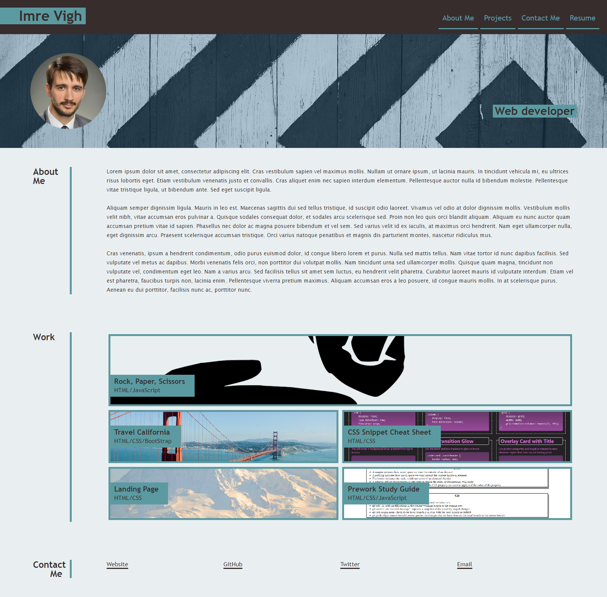

# Portfolio_Webpage

## Description
This is my portfolio website which tells a little bit about me and gives an overview of my works.

## Usage
It doesn't require any installation. The webpage contains a navbar with navigation links, a Hero banner, an About Section, a Projects section and a Contact section. As a user you can navigate to the corresponding sections of the page from the links of the Navigation Bar. You can find my full name, a photo and my job role in the Hero section. The Projects section contains titled images of my applications which will redirect you to the projects' websites by clicking on them. If you resize the browser window you will be able to see the responsive layout of the website.
Please see the mockup image of the website below:

Here is the link for the deployed webpage: https://vighimre87.github.io/Portfolio_Webpage/

## Credits
N/A

## License
Plese refer to the LICENSE file in the repo.